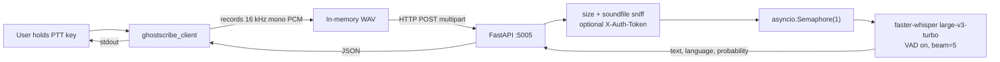

# GhostScribe

Low-latency, intranet-only speech-to-text. A GPU-resident
`faster-whisper large-v3-turbo` server plus a minimal push-to-talk
Python client.

This is the **first commit**: server is production-shaped (FastAPI +
systemd), client is intentionally dumb (prints transcripts to stdout,
no clipboard injection yet).

See `start_requirements.md` for the product vision.

## Architecture



## Repo layout

```
ghostscribe/
  server/                          FastAPI app + systemd unit
    ghostscribe_server/
    assets/silence_1s.wav          warm-up sample
    systemd/ghostscribe-server.service
    systemd/server.env.example
    pyproject.toml
    requirements.txt
  client/                          minimal PTT CLI
    ghostscribe_client/
    config.example.toml
    pyproject.toml
    requirements.txt
  start_requirements.md            product spec
```

## API

All routes under `/v1/`. Responses are JSON `{text, language, language_probability}`.

| Method | Path          | Behaviour                                              |
| ------ | ------------- | ------------------------------------------------------ |
| GET    | `/v1/health`  | Liveness + readiness probe.                            |
| POST   | `/v1/en`      | English audio in -> English text.                      |
| POST   | `/v1/sk`      | Slovak audio in -> English text (Whisper `translate`). |
| POST   | `/v1/auto`    | Autodetect language, transcribe (no translation).      |

All POST endpoints accept a multipart form field named `audio`. If
`GHOSTSCRIBE_AUTH_TOKEN` is set on the server, clients must send an
`X-Auth-Token` header.

Swagger UI is at `http://HOST:5005/docs`.

## Server

### Prerequisites

- Linux (tested target: Linux Mint 21/22 with an X11 session).
- NVIDIA GPU with recent driver + CUDA runtime. RTX 5060 Ti (Blackwell, sm_120) requires **CUDA 12.8+** and a `ctranslate2` build that supports it; `faster-whisper >= 1.1.0` ships compatible wheels. If you see `no kernel image available`, upgrade `ctranslate2`.
- Python 3.10+.

### Install (manual, one-time)

```bash
sudo useradd --system --home /opt/ghostscribe --shell /usr/sbin/nologin ghostscribe
sudo mkdir -p /opt/ghostscribe /etc/ghostscribe
sudo chown -R ghostscribe:ghostscribe /opt/ghostscribe

sudo -u ghostscribe git clone https://github.com/your-org/ghostscribe.git /opt/ghostscribe

cd /opt/ghostscribe/server
sudo -u ghostscribe python3 -m venv .venv
sudo -u ghostscribe .venv/bin/pip install --upgrade pip
sudo -u ghostscribe .venv/bin/pip install -r requirements.txt
sudo -u ghostscribe mkdir -p logs

sudo cp systemd/server.env.example /etc/ghostscribe/server.env
sudo $EDITOR /etc/ghostscribe/server.env

sudo cp systemd/ghostscribe-server.service /etc/systemd/system/
sudo systemctl daemon-reload
sudo systemctl enable --now ghostscribe-server
sudo systemctl status ghostscribe-server
journalctl -u ghostscribe-server -f
```

Give it up to ~30 s on first boot: the model needs to download and warm
up. `/v1/health` returns `"ready": true` once it's ready.

### Running without systemd (dev)

```bash
cd server
python -m venv .venv
. .venv/bin/activate
pip install -r requirements.txt
uvicorn ghostscribe_server.app:app --host 0.0.0.0 --port 5005 --workers 1
```

`--workers 1` is not optional: more workers would load the model N
times and blow out VRAM.

### Configuration

All env vars are optional. Defaults in parentheses:

| Variable                    | Default                                  |
| --------------------------- | ---------------------------------------- |
| `GHOSTSCRIBE_HOST`          | `0.0.0.0`                                |
| `GHOSTSCRIBE_PORT`          | `5005`                                   |
| `GHOSTSCRIBE_MODEL`         | `large-v3-turbo`                         |
| `GHOSTSCRIBE_DEVICE`        | `cuda`                                   |
| `GHOSTSCRIBE_COMPUTE_TYPE`  | `int8_float16`                           |
| `GHOSTSCRIBE_LOG_PATH`      | `./logs/ghostscribe_server.log`          |
| `GHOSTSCRIBE_MAX_UPLOAD_MB` | `25`                                     |
| `GHOSTSCRIBE_AUTH_TOKEN`    | *(unset -> auth disabled)*               |

### Smoke test

Record a short WAV (or use any `.wav`/`.flac`/`.ogg` file):

```bash
arecord -d 3 -f S16_LE -r 16000 -c 1 sample.wav   # Linux
curl -F "audio=@sample.wav" http://localhost:5005/v1/auto
curl http://localhost:5005/v1/health
```

## Client

### Install

```bash
cd client
python3 -m venv .venv
. .venv/bin/activate
pip install -r requirements.txt
cp config.example.toml config.toml
$EDITOR config.toml
```

On Linux you also need PortAudio for `sounddevice`:

```bash
sudo apt install libportaudio2
```

### Usage

```bash
python -m ghostscribe_client
```

Hold the PTT key (default: Right Ctrl). Speak. Release. The transcript
appears on stdout; timing info and recording status go to stderr:

```
GhostScribe client -> http://localhost:5005/v1/auto
config:   /home/me/.config/ghostscribe/config.toml
ptt key:  ctrl_r
device:   (system default)
auth:     off
Hold the PTT key and speak. Release to transcribe. Ctrl+C to quit.
[rec] ...
[rec] stopped, 112 kB
[recv] 112 kB in 430 ms (lang=en p=0.99)
Hello, this is a test transcription.
```

CLI flags override config values: `--endpoint /v1/sk`, `--server-url ...`,
`--ptt-key f12`, `--auth-token ...`, `--input-device "USB Mic"`.

### Notes / known limitations

- Global keyboard hooks work on **X11** (e.g. Linux Mint Cinnamon's
  default). On **Wayland** `pynput` cannot install a global hook; run
  the client in a terminal that has focus, or switch the session to X11.
- Mouse Button 8/9 PTT is **not** wired up in this commit. Coming next.
- The client **does not paste into the focused app** yet -- it just
  prints the transcript. Save-Paste-Restore lands in a later commit.

## Explicitly deferred (coming in later commits)

- Save-Paste-Restore clipboard injection with configurable paste delay.
- Mouse Button 8/9 PTT (with `pynput` + `python-evdev` backends).
- Terminal detection and bracketed-paste fallback.
- WebSocket streaming (`/v1/stream`) for word-level incremental output.
- Client-side VAD (server-side VAD is already enabled).
- TLS, IP allowlists, Prometheus metrics, system tray icon.
- Rust client rewrite.

## Security note

The server is intended for **intranet** deployment. It binds `0.0.0.0`
by default and has no TLS of its own. If your network isn't trusted, at
minimum set `GHOSTSCRIBE_AUTH_TOKEN` and put a reverse proxy (nginx,
Caddy, Traefik) with TLS in front of it.

## License

MIT (see repo root when a `LICENSE` file is added).
