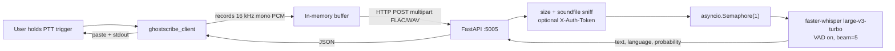

# GhostScribe

Low-latency, intranet-only speech-to-text. A GPU-resident
`faster-whisper large-v3-turbo` server plus push-to-talk clients for
Linux (Python) and Windows (Rust).

See `start_requirements.md` for the original product spec.

## Architecture



## Repo layout

```
ghostscribe/
  server/                          FastAPI app + systemd unit
    ghostscribe_server/
    tests/                         pytest suite
    assets/silence_1s.wav          warm-up sample
    systemd/ghostscribe-server.service
    systemd/server.env.example
    pyproject.toml
  client/
    linux/                         Linux PTT client (Python + pynput)
      ghostscribe_client/
      tests/
      config.example.toml
      pyproject.toml
    windows/                       Windows PTT client (Rust)
      src/
      tests/
      config.example.toml
      Cargo.toml
  .github/workflows/ci.yml         CI (pytest + cargo test)
  HARDWARE.md                      reference host hardware
  start_requirements.md            product spec
```

## API

All routes under `/v1/`. Responses are JSON `{text, language, language_probability}`.

| Method | Path          | Behaviour                                              |
| ------ | ------------- | ------------------------------------------------------ |
| GET    | `/v1/health`  | Liveness + readiness probe.                            |
| POST   | `/v1/en`      | English audio in -> English text.                      |
| POST   | `/v1/auto`    | Autodetect language, transcribe (no translation).      |
| GET    | `/metrics`    | Prometheus exposition: request count, request/inference/audio durations. |

All POST endpoints accept a multipart form field named `audio`. If
`GHOSTSCRIBE_AUTH_TOKEN` is set on the server, clients must send an
`X-Auth-Token` header.

Swagger UI is at `http://HOST:5005/docs`.

## Server

### Prerequisites

- Linux (tested: Linux Mint 22 with an X11 session).
- NVIDIA GPU with recent driver + CUDA runtime. RTX 5060 Ti (Blackwell, sm_120) requires **CUDA 12.8+** and a `ctranslate2` build that supports it; `faster-whisper >= 1.1.0` ships compatible wheels. If you see `no kernel image available`, upgrade `ctranslate2`. See `HARDWARE.md` for the reference host configuration.
- Python 3.10+.

### Install (manual, one-time)

```bash
sudo useradd --system --home /opt/ghostscribe --shell /usr/sbin/nologin ghostscribe
sudo mkdir -p /opt/ghostscribe /etc/ghostscribe
sudo chown -R ghostscribe:ghostscribe /opt/ghostscribe

sudo -u ghostscribe git clone https://github.com/your-org/ghostscribe.git /opt/ghostscribe

cd /opt/ghostscribe/server
sudo -u ghostscribe python3 -m venv .venv
sudo -u ghostscribe .venv/bin/pip install --upgrade pip
sudo -u ghostscribe .venv/bin/pip install -e .
sudo -u ghostscribe mkdir -p logs

sudo cp systemd/server.env.example /etc/ghostscribe/server.env
sudo $EDITOR /etc/ghostscribe/server.env

sudo cp systemd/ghostscribe-server.service /etc/systemd/system/
sudo systemctl daemon-reload
sudo systemctl enable --now ghostscribe-server
sudo systemctl status ghostscribe-server
journalctl -u ghostscribe-server -f
```

Give it up to ~30 s on first boot: the model needs to download and warm
up. `/v1/health` returns `"ready": true` once it's ready.

### Running without systemd (dev)

```bash
cd server
python -m venv .venv
. .venv/bin/activate
pip install -e .
uvicorn ghostscribe_server.app:app --host 0.0.0.0 --port 5005 --workers 1
```

`--workers 1` is not optional: more workers would load the model N
times and blow out VRAM.

### Configuration

All env vars are optional. Defaults in parentheses:

| Variable                    | Default                                  |
| --------------------------- | ---------------------------------------- |
| `GHOSTSCRIBE_HOST`          | `0.0.0.0`                                |
| `GHOSTSCRIBE_PORT`          | `5005`                                   |
| `GHOSTSCRIBE_MODEL`         | `large-v3-turbo`                         |
| `GHOSTSCRIBE_DEVICE`        | `cuda`                                   |
| `GHOSTSCRIBE_COMPUTE_TYPE`  | `int8_float16`                           |
| `GHOSTSCRIBE_LOG_PATH`      | `./logs/ghostscribe_server.log`          |
| `GHOSTSCRIBE_MAX_UPLOAD_MB` | `25`                                     |
| `GHOSTSCRIBE_AUTH_TOKEN`    | *(unset -> auth disabled)*               |

### Smoke test

```bash
arecord -d 3 -f S16_LE -r 16000 -c 1 sample.wav   # Linux
curl -F "audio=@sample.wav" http://localhost:5005/v1/auto
curl http://localhost:5005/v1/health
```

## Clients

The repo hosts one client per platform under `client/`. They are
independent projects with their own build systems.

- `client/linux/` — Python client for X11 Linux. Instructions below.
- `client/windows/` — Rust client for Windows 10/11. See
  [client/windows/README.md](client/windows/README.md).

## Linux client

### Install

```bash
cd client/linux
python3 -m venv .venv
. .venv/bin/activate
pip install -e .
cp config.example.toml ~/.config/ghostscribe/config.toml
$EDITOR ~/.config/ghostscribe/config.toml
```

On Linux you also need PortAudio for `sounddevice`, `xclip` for the
clipboard push, and `xdotool` so the client can detect when the focused
window is a terminal emulator and switch to `Ctrl+Shift+V`:

```bash
sudo apt install libportaudio2 xclip xdotool
```

`xdotool` is optional — the client falls back to plain `Ctrl+V`
everywhere if it is missing — but most terminal emulators (GNOME
Terminal, Konsole, kitty, alacritty, wezterm, ...) intentionally ignore
`Ctrl+V`, so install it if you dictate into terminals.

### Usage

```bash
python -m ghostscribe_client
```

Hold the configured trigger (default: mouse button `x2` — the thumb
"forward" button). Speak. Release. The current X11 CLIPBOARD is saved,
the transcript is pushed onto the CLIPBOARD via `xclip`, paste is
simulated into the focused window (`Ctrl+V`, or `Ctrl+Shift+V` when the
focused window is a known terminal emulator), and after `paste_delay_ms`
the original clipboard contents are restored. Timing and the transcript
also print to stderr:

```
GhostScribe client -> http://localhost:5005/v1/auto
config:   /home/me/.config/ghostscribe/config.toml
trigger:  mouse:x2
one_key:  off
device:   (system default)
format:   flac
paste:    on (delay 50 ms)
auth:     off
Hold the trigger and speak. Release to transcribe. Ctrl+C to quit.
[rec] ...
[rec] stopped, 96 kB raw
[recv] 54 kB in 430 ms (lang=en p=0.99)
[paste] clipboard restored
[paste] pasted via ctrl+v into focused window:
Hello, this is a test transcription.
```

### Trigger formats

- `mouse:<button>` — `left`, `middle`, `right`, `x1` / `back`,
  `x2` / `forward`, or `button8` / `button9`.
- `key:<name>` — any pynput `keyboard.Key` name (`ctrl_r`, `f12`, ...)
  or a single character.
- `key:<mods>+<key>` — chord, e.g. `key:ctrl+g`, `key:ctrl+shift+space`.
  Modifiers: `ctrl`, `shift`, `alt`, `super` (each matches both left
  and right variants). Releasing either the target or any modifier
  stops recording and sends.

### One-key trigger (`one_key_trigger`)

An optional second PTT mode that coexists with `trigger`. Set it in
`config.toml`:

```toml
trigger         = "key:ctrl+g"   # existing chord trigger (unchanged)
one_key_trigger = "key:ctrl"     # new: press ctrl alone to record
```

Allowed values: `key:ctrl`, `key:alt`, `key:f1`–`key:f24`. Empty (the
default) disables it. Letters, digits, shift, and super are rejected
because they would hijack normal typing.

**Semantics:** Press the one-key alone → start recording; release → send.
If any *other* key is pressed while the one-key is held, the take is
cancelled (no upload) and the client locks out until the one-key is
released. Keys that are part of the configured `trigger` chord are treated
as neutral and do not cancel. First trigger to engage wins — if the chord
fires first, one-key is dormant for that take.

### Config search order

1. `--config PATH` CLI argument
2. `$XDG_CONFIG_HOME/ghostscribe/config.toml`
3. `~/.config/ghostscribe/config.toml`
4. `./config.toml` (current working directory)

### CLI flag reference

`--endpoint /v1/en`, `--server-url ...`, `--trigger key:ctrl+g`,
`--auth-token ...`, `--input-device "USB Mic"`, `--audio-format wav`,
`--no-paste`, `--paste-delay-ms 100`.

### Notes / known limitations

- Global hooks (keyboard and mouse) work on **X11** (Linux Mint
  Cinnamon's default). On **Wayland** `pynput` cannot install a global
  hook; run the client in a terminal that has focus, or switch the
  session to X11.
- Auto-paste preserves your clipboard: saves the current X11 CLIPBOARD,
  sets the transcript (with a trailing space so back-to-back takes
  don't concatenate), injects paste, then restores the original after
  `paste_delay_ms`. If you copy something **between** the paste and the
  restore, the restore will clobber it.
- Terminal detection uses `xdotool getactivewindow getwindowclassname`:
  known terminal emulators receive `Ctrl+Shift+V`; everything else
  receives `Ctrl+V`.

## Security note

The server is intended for **intranet** deployment. It binds `0.0.0.0`
by default and has no TLS of its own. If your network isn't trusted, set
`GHOSTSCRIBE_AUTH_TOKEN` to require a shared secret on every request.
See `server/AUTH.md` for the step-by-step setup guide.

## License

MIT (see repo root when a `LICENSE` file is added).
